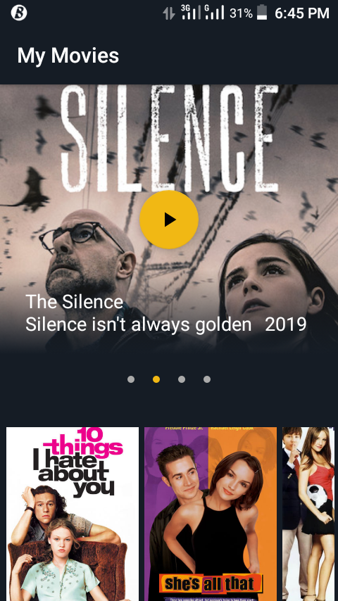

# MovieStreamingApp

This is a Movie streaming `Android` Application written in `Java`. It has a very beatiful UI designed with 
the user in mind: some features included are:

<ol>
<li>TIMED VIEWPAGER</li>
<li>SEARCH VIEW</li>
<li>SWIPE TO REFRESH</li>
<li>HORIZONTAL RECYCLER VIEW</li>
</ol>

more amazing features would be added as time goes on.

### UI/UX ###

It has an intuitive user interface that allows the user to swipe across the recycler view and select movies.
There are various animations to give the user an immersive experience, and also haptic feedback when movies are clicked.

# Pre-ScreenShots

